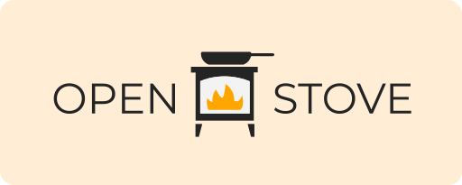

  

  

&nbsp;

>Welcome to **OpenStove — A Curated Collection of Community-Crafted Recipes**. OpenStove is a digital gathering space where culinary enthusiasts come together to discover, share, and contribute recipes. No ads, no fees —  just a love for food and community.

## What is OpenStove?

OpenStove is built on the belief that the best cooking experiences come from shared knowledge. We provide a platform free from distracting ads where you have direct access to a diverse collection of dishes curated and cherished by food lovers from all over the world.

## Tailored for Food Lovers

Discover new recipes from our ever-growing database, curated by food lovers worldwide. OpenStove is more than just a recipe site — it's a collective archive of culinary delights, where each contribution enriches our cooking experience.

## Contribute a Recipe

We encourage everyone to share their recipes and tips! Here's how:

1. Check out our [CONTRIBUTING.md](https://github.com/mearashadowfax/OpenStove/blob/main/CONTRIBUTING.md) for detailed guidelines.
2. Follow the simple format to ensure consistency across our collection.
3. Submit a pull request with your recipe for the community to enjoy!

## License

OpenStove is licensed under the [Creative Commons Attribution-NonCommercial-ShareAlike 4.0 International License](http://creativecommons.org/licenses/by-nc-sa/4.0/).

- **Attribute** — Provide proper credit, link to the license, and note any changes.
- **NonCommercial** — Material cannot be used for commercial purposes.
- **ShareAlike** — If you remix, transform, or build upon the material, distribute your contributions under the same license as the original.

[View Full License](https://github.com/mearashadowfax/OpenStove/blob/main/LICENSE)
